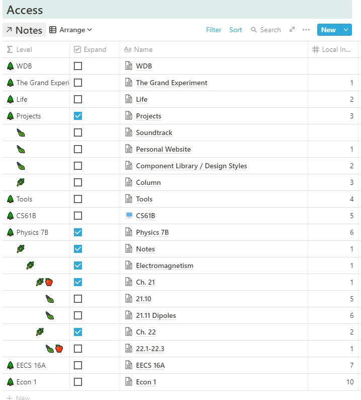

Notion doesn't really organize its pages hierarchically. It's mostly a jumbled graph with pages and links everywhere. I wanted to create a system that would organize pages hierarchically, with the constraint that all the pages had to be in the same exact database, so I could filter and search the database independent of my other pages, as well as incorperate features like reminders to review certain notes.

